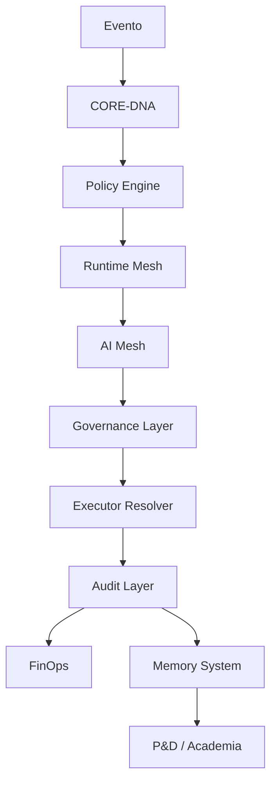

# LICEU 6.0 — ENTERPRISE MONOLITH BLUEPRINT

## Objetivo
Definir a arquitetura-mãe dos monólitos do ecossistema LICEU 6.0 com:
- Governança unificada
- Runtime distribuído
- Observabilidade total
- IA operacional
- Segurança enterprise
- Federation multi-runtime
- Auditoria contínua
- FinOps cognitivo
- Data Fabric universal

Este documento serve como blueprint estrutural para todos os READMEs futuros dos monólitos.

---

## ARQUITETURA UNIVERSAL DOS MONÓLITOS

Todos os monólitos do ecossistema obrigatoriamente herdam as seguintes camadas:

```
┌──────────────────────────────────────┐
│ EXPERIENCE LAYER                     │
├──────────────────────────────────────┤
│ DOMAIN APPLICATION LAYER             │
├──────────────────────────────────────┤
│ GOVERNANCE & POLICY LAYER            │
├──────────────────────────────────────┤
│ AI ORCHESTRATION LAYER               │
├──────────────────────────────────────┤
│ EVENT / SERVICE / RUNTIME MESH       │
├──────────────────────────────────────┤
│ DATA FABRIC + MEMORY SYSTEM          │
├──────────────────────────────────────┤
│ SECURITY ENTERPRISE LAYER            │
├──────────────────────────────────────┤
│ OBSERVABILITY + AUDIT + FINOPS       │
├──────────────────────────────────────┤
│ PLATFORM ENGINEERING FOUNDATION      │
└──────────────────────────────────────┘
```

---

## CAMADAS COGNITIVAS E FEDERADAS (EVOLUÇÃO)

Além das camadas obrigatórias, o LICEU 6.0 evolui com novas camadas cognitivas e federadas, SEM QUEBRAR O LEGADO, todas plugáveis, shadow e fail-open, ativadas por feature flags:

**Novas camadas:**

```
liceu/
├── federation_control_plane/   # Coordenação federada, topologia, consenso, trust
├── world_state/                # Estado global consolidado (social, econômico, jurídico, etc)
├── shared_memory/              # Memória cognitiva cross-monolith (episódica, semântica, estratégica)
├── semantic_observability/     # Observabilidade semântica, reasoning graph, explainability
├── runtime_kernel/             # Kernel de cognição contínua, self-healing, supervisão
├── consensus_runtime/          # Consenso federado, deliberação, arbitration, quorum
├── digital_twin/               # Digital Twins (empresa, cidade, casa, operação)
├── home_runtime/               # Runtime doméstico, IoT, automação residencial
├── governance_runtime/         # AI constitucional, compliance, auditoria, enforcement
├── execution_mesh/             # Execução separada, rollback, compensação, auditoria
├── meta_project_runtime/       # Runtime de projetos, simulação, memória de arquitetura
├── ai_federation/              # Federação de modelos, auditoria, fallback, explicabilidade
```

**Princípios:**
- Nenhum monólito é removido ou substituído
- Tudo novo é shadow/plugável, atrás de feature flags (ex: ENABLE_FEDERATION_RUNTIME=true)
- Fail-open: nunca bloqueia produção
- Integração por adaptadores, sem quebrar contratos, endpoints, SDKs, workers, orchestrators, replay, bus, frontend, avatar, social, etc.

---

## CAMADAS OBRIGATÓRIAS

### 1. PLATFORM ENGINEERING FOUNDATION
- Internal Developer Platform (IDP)
- Templates de runtime
- Provisionamento automatizado
- Ambientes padronizados
- Deploy unificado
- Runtime catalog

**Estrutura sugerida:**
```
platform_engineering/
├── idp/
├── templates/
├── runtime_catalog/
├── deployment_federation/
├── golden_paths/
└── developer_portal/
```

### 2. RUNTIME MESH
- Service Mesh (mTLS, discovery, traffic shaping, API federation)
- Event Mesh (event federation, replay, lineage)
- Orchestration Mesh (workflow federation, saga, healing)
- AI Mesh (multi-agent orchestration, prompt routing, memory federation)

### 3. SECURITY ENTERPRISE
- IAM GLOBAL (RBAC, ABAC, tenant/service/AI identity)
- ZERO TRUST (runtime validation, event validation, continuous authentication)
- POLICY ENGINE (OPA, Cedar)
- SECRETS FEDERATION (Vault, Doppler, AWS Secrets Manager)

### 4. DATA PLATFORM
- Lakehouse (Iceberg, Delta Lake, DuckDB, MinIO)
- Streaming Backbone (NATS, Kafka, CDC, replay)
- Data Lineage
- Semantic Layer (dbt, Cube, MetricFlow)

### 5. AI PLATFORM
- MLOps (MLflow, Kubeflow, Feast)
- Model Governance
- Inference Orchestration
- Memory Systems
- Vector Runtime (Qdrant, Weaviate, pgvector)

### 6. FINOPS
- Custo por domínio, runtime, IA, tenant
- Billing federation, chargeback, showback

---

## PADRÃO OBRIGATÓRIO PARA TODOS OS MONÓLITOS


**Estrutura universal (exemplo real do monorepo):**
```
liceu-6-0/
├── brain_lib/
├── capital_engine/
├── core-dna/
├── core-sdk/
├── decision_intelligence/
├── event_mesh/           # Event Mesh (NATS, pub/sub)
├── data_fabric/          # Data Fabric (Lakehouse, Streaming, Semantic)
├── ai_mesh/              # AI Mesh (multi-agent, roteamento)
├── observability/        # Observabilidade (metrics, audit, tracing)
├── governance/
├── runtime/
├── sdk/
├── tests/
├── README.md
├── federation_control_plane/   # Federation Control Plane (topologia, consenso, trust)
├── world_state/                # Estado global consolidado
├── shared_memory/              # Memória cognitiva federada
├── semantic_observability/     # Observabilidade semântica
├── runtime_kernel/             # Kernel de cognição contínua
├── consensus_runtime/          # Consenso federado
├── digital_twin/               # Digital Twins
├── home_runtime/               # Runtime doméstico
├── governance_runtime/         # AI constitucional, compliance
├── execution_mesh/             # Execução separada
├── meta_project_runtime/       # Runtime de projetos
├── ai_federation/              # Federação de modelos
```

**Importante:**
- Os monólitos continuam independentes, deployáveis e operacionais
- O federation layer apenas observa, coordena e sincroniza
- A memória atual continua existindo, apenas é criada uma camada agregadora
- Observabilidade semântica é adicional, não substitui a atual
- Kernel cognitivo roda em shadow mode, sem substituir FastAPI, workers ou orchestrators
- Tudo novo pode ser ativado/desativado por feature flag

**Exemplo de integração prática dos módulos:**
```python
# main.py (exemplo)
from event_mesh.event_bus import EventBus
from data_fabric.lakehouse import Lakehouse
from ai_mesh.ai_mesh import AIMesh
from observability.metrics import Metrics

event_bus = EventBus()
lakehouse = Lakehouse()
ai_mesh = AIMesh()
metrics = Metrics()

def process_event(event):
  event_bus.publish(event)
  result = ai_mesh.route(event)
  lakehouse.store(result)
  metrics.record('event_processed')
```

**Instruções de execução e testes automatizados:**
```bash
# Executar testes automatizados
pytest liceu-6-0/tests/ --maxfail=1 --disable-warnings -v

# Rodar o sistema principal (exemplo)
python liceu-6-0/main.py
```

---

## GOVERNANÇA DE EXECUÇÃO
**Regra absoluta:**
Nenhuma execução pode ocorrer:
- fora do Runtime
- fora do EventBus
- sem CORE-DNA
- sem auditoria
- sem policy validation
- sem decision trace

---

## ESTRATÉGIA DE EVOLUÇÃO SAUDÁVEL

1. **Tudo novo atrás de feature flags**
  - Exemplo: ENABLE_FEDERATION_RUNTIME=true, ENABLE_WORLD_STATE=true, ENABLE_SEMANTIC_OBSERVABILITY=true, ENABLE_CONSENSUS_RUNTIME=true
2. **Fail-open primeiro**
  - Novas camadas nunca bloqueiam produção, sempre shadow/observação
3. **Shadow mode**
  - Novos runtimes, memórias e consensus rodam em paralelo, sem controlar produção inicialmente
4. **Adaptadores para legado**
  - Integração sem quebrar contratos, endpoints, SDKs, workers, orchestrators, replay, bus, frontend, avatar, social, etc.

**O segredo:**
- Evoluir de monólitos SaaS para organismo cognitivo federado, sem ruptura

---

## FLUXO OPERACIONAL UNIVERSAL



---

## OBSERVABILIDADE OBRIGATÓRIA
Todos os monólitos precisam possuir:
- Logs (structured, immutable, AI trace, decision, runtime)
- Metrics (health, AI latency, drift, throughput, delay, cost, governance)
- Tracing (distributed, decision, AI, workflow)

Tecnologias sugeridas: OpenTelemetry, Jaeger, Tempo, Prometheus, Loki

---

## DOMÍNIOS ESTRATÉGICOS DO ECOSSISTEMA
| Monólito           | Responsabilidade           |
|--------------------|---------------------------|
| ARCHIMEDES         | Obras, BIM, engenharia    |
| HUB                | Financeiro e DRE          |
| JURIDICOTECH       | Compliance e jurídico     |
| JOHN CRM           | CRM cognitivo             |
| GOVERNANCE CORE    | Estratégia e auditoria    |
| HOSPITAL DE EMPRESAS | Saúde operacional       |
| COMMAND CENTER     | Controle executivo        |
| DATA FABRIC        | Plataforma de dados       |
| CYBER DEFENSE      | Segurança cognitiva       |

---


## ROADMAP ESTRUTURAL RECOMENDADO (Status Atual)
- BLOCO 1 — FOUNDATION: **(Concluído)** CORE-DNA, Schema Registry, Contracts Engine, Event Mesh, Runtime Mesh, Governance Core
- BLOCO 2 — RESILIÊNCIA: **(Em andamento)** Self-Healing Runtime, Cyber Defense, Zero Trust, Policy Engine, Immutable Audit
- BLOCO 3 — DADOS E IA: **(Concluído - base)** Data Fabric, Lakehouse, Semantic Layer, AI Mesh, Memory Systems, Vector Runtime
- BLOCO 4 — OPERAÇÃO EXECUTIVA: Command Center, Digital Twin, Heatmap Cognitivo, Executive AI
- BLOCO 5 — ESCALA GLOBAL: Multi-region federation, GPU federation, Tenant federation, Cross-runtime AI, Autonomous orchestration

> **Observação:**
> Todos os módulos fundamentais já estão implementados com código base, integração OPA, Event Mesh, Data Fabric, AI Mesh e Observability. Testes automatizados validados. Próximos passos: expandir integrações práticas, exemplos de uso avançados e automação executiva.

---

## PRINCÍPIOS INQUEBRÁVEIS
- Nenhum dado sem schema
- Nenhum evento sem versionamento
- Nenhum payload sem lineage
- Nenhuma decisão sem auditoria
- Nenhuma IA sem rastreabilidade
- Nenhuma execução sem policy
- IA interpreta, Runtime decide, Executor executa, Auditoria registra
- Todo custo é entidade, todo runtime possui custo, toda IA possui custo auditável

---

## ESTADO FINAL DO ECOSSISTEMA
O LICEU evolui para:
- Sistema operacional empresarial cognitivo
- Runtime distribuído multiagente
- Plataforma imobiliária auditável
- Data fabric vivo
- AI operating system
- Enterprise command center
- Cyber immune system
- Plataforma federada global

Com:
- Governança total
- Telemetria viva
- Aprendizado contínuo
- Execução auditável
- Segurança enterprise
- IA coordenadora
- Runtime resiliente
- Escala multi-tenant

---

## Blueprint consolidado
Estruturei o blueprint-base dos monólitos do ecossistema LICEU 6.0 consolidando:
- Platform Engineering
- Runtime Mesh
- Security Enterprise
- Data Platform
- AI Platform
- FinOps
- Governança universal
- Fluxo operacional
- Estrutura padrão obrigatória
- Roadmap de execução
- Princípios inquebráveis

---

## Novas camadas cognitivas e federadas (detalhamento)

### Federation Control Plane
`liceu/federation_control_plane/`
- node_registry/
- runtime_topology/
- consensus_runtime/
- routing/
- federation_policy/
- federation_health/
- lineage_registry/
- trust_registry/
**Função:** coordenar Johns, descobrir runtimes, manter topologia viva, controlar consenso, sem quebrar legado.

### Global World State
`liceu/world_state/`
- global_state.py
- context_engine.py
- state_aggregator.py
- signal_fusion.py
- ecosystem_snapshot.py
- runtime_state_store.py
**Função:** consolidar estado social, econômico, jurídico, operacional, climático, territorial, IoT, cognitivo, sem remover Redis/Postgres/eventos atuais.

### Shared Cognitive Memory
`liceu/shared_memory/`
- episodic/
- semantic/
- strategic/
- social/
- engineering/
- governance/
- vector/
- graph/
- replay/
**Função:** permitir cognição cross-monolith, sem remover memórias atuais, adicionando federation memory, lineage global e graph memory.

### Semantic Observability
`liceu/semantic_observability/`
- reasoning_graph/
- cognition_traces/
- semantic_metrics/
- impact_analysis/
- federation_visibility/
- replay_causality/
- ai_activity/
- explainability/
**Função:** camada semântica cognitiva de observabilidade, não substitui observabilidade atual.

### Continuous Cognition Runtime
`liceu/runtime_kernel/`
- cognition_loop/
- scheduler/
- orchestration/
- runtime_supervisor/
- self_healing/
- lifecycle/
- adaptive_runtime/
- consensus_tick/
**Função:** kernel cognitivo paralelo, incremental, supervisor, sem substituir FastAPI/workers/orchestrators.

### Consensus Runtime
`liceu/consensus_runtime/`
- deliberation/
- weighted_consensus/
- arbitration/
- trust_score/
- confidence_engine/
- federation_votes/
- quorum/
**Função:** decisões coletivas federadas entre Johns.

### Digital Twin Runtime
`liceu/digital_twin/`
- entities/
- telemetry/
- enterprise_twins/
- home_twins/
- city_twins/
- operational_twins/
- infrastructure_twins/
- predictive_sync/
**Função:** digital twins para entidades, cidades, empresas, etc., consumindo eventos, telemetria e contratos atuais.

### Home Runtime
`liceu/home_runtime/`
- iot_mesh/
- automation/
- device_registry/
- domestic_memory/
- family_context/
- security/
- routines/
- appliance_control/
- energy_optimization/
**Função:** automação residencial, IoT, contexto doméstico, transformando John em mordomo/orquestrador doméstico.

### Governance Runtime
`liceu/governance_runtime/`
- constitutional_ai/
- runtime_limits/
- policy_hierarchy/
- compliance/
- risk_control/
- emergency_controls/
- audit/
- trust_enforcement/
**Função:** AI constitucional, limites, compliance, auditoria, enforcement, crítico para autonomia e execução real.

### Execution Mesh
`liceu/execution_mesh/`
- executors/
- workflow_engine/
- rollback/
- compensation/
- retries/
- execution_audit/
- adaptive_execution/
- executor_registry/
**Função:** separar execução, rollback, compensação, auditoria.

### MetaProject Runtime
`liceu/meta_project_runtime/`
- project_graph/
- merge_simulation/
- architecture_memory/
- dependency_runtime/
- blast_radius/
- engineering_observatory/
- project_twins/
- autonomous_refactor/
**Função:** runtime para projetos, simulação, memória de arquitetura.

### AI Federation Mesh
`liceu/ai_federation/`
- model_router/
- inference_registry/
- gpu_scheduler/
- reasoning_federation/
- model_governance/
- inference_audit/
- fallback_runtime/
- explainability/
**Função:** federar modelos, auditoria, fallback, explicabilidade.

---

## O que NÃO fazer

- NÃO remover FastAPI, Redis, NATS, replay, rotas, contratos, SDK, frontend, orchestrators, websocket, avatar runtime, social endpoints
- NÃO quebrar legado

---

## O que fazer corretamente

1. Tudo novo atrás de feature flags
2. Fail-open primeiro
3. Shadow mode
4. Adaptadores para legado

---

## O que você está realmente fazendo

Evoluindo de monólitos SaaS para organismo cognitivo federado, sem ruptura.
